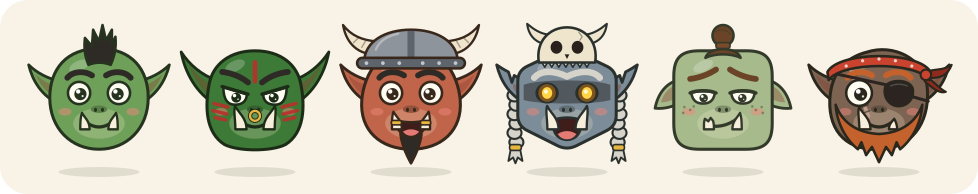
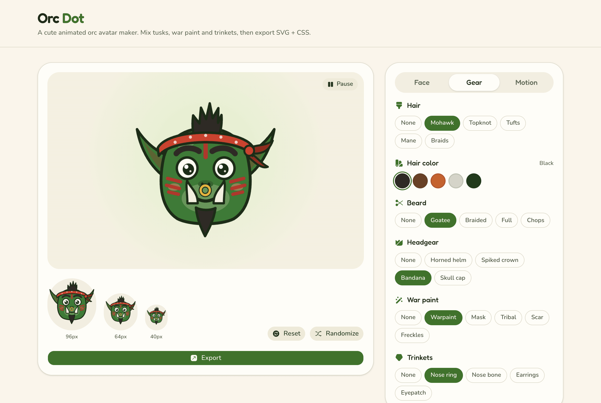
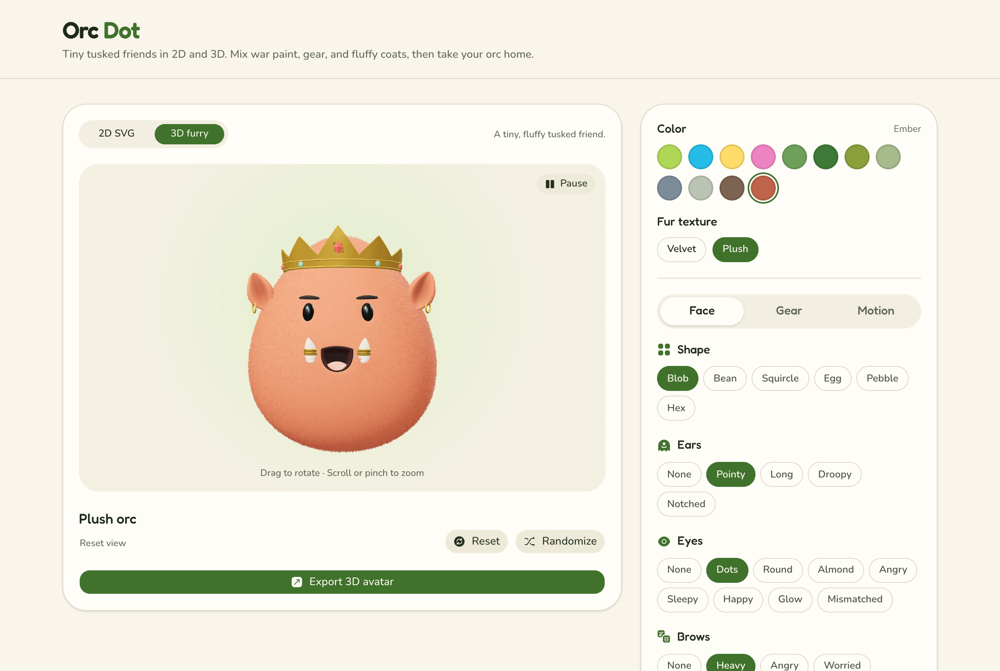

<div align="center">



# Orc Dot

**Tiny tusked friends, hand-assembled in your browser.**

Build a cute animated orc avatar, give it a horned helm and a questionable nose ring,<br>
then take it home as a tidy SVG + CSS snippet. No sign-up, no uploads, no goblins.

### [🟢 Summon an orc → orc-dot.web.app](https://orc-dot.web.app)

</div>

---

## What is this?

Orc Dot is a little avatar studio for people who think every profile picture should have tusks.

Pick a head shape, slap on some war paint, choose how your orc wiggles, and export it. In **2D SVG** mode, your orc is one SVG plus a small CSS file. It stays crisp at 16px or on a billboard, and it breathes, blinks and twitches its ears on its own. Switch to **3D furry** for a plush orc with short, dense fur and orc gear.

<div align="center">

</div>

## The armory 🪓

Mix and match from **six head shapes** and a **pile of gear**. Every accessory lines up on every shape, because each head is drawn on the same frame.

| | |
|---|---|
| **Heads** | blob, bean, squircle, egg, pebble, hex |
| **Skins** | moss, forest, olive, sage, slate, ash, umber, ember |
| **Ears** | pointy, long, droopy, notched (battle-tested™), or none |
| **Eyes** | dots, round, almond, angry, sleepy, happy, glow, mismatched |
| **Brows** | heavy, angry, worried, unibrow |
| **Mouths** | smile, grin, smirk, grumpy, roar |
| **Tusks** | small, medium, large, asymmetric, chipped, gilded (they grow *up*, like proper tusks) |
| **Hair** | mohawk, topknot, tufts, mane, braids, in black, brown, ginger, silver, or matched to the orc (skin tone in 2D, coat color in 3D) |
| **Beards** | goatee, braided, full, mutton chops |
| **Headgear** | horned helm, spiked crown, bandana, skull cap |
| **War paint** | warpaint, mask, tribal, scar, freckles |
| **Trinkets** | nose ring, nose bone, earrings, eyepatch |

Can't decide? Smash **Randomize** until an orc speaks to you.

> **Wardrobe rules:** a helmet won't fit over a mohawk, a crown squashes a topknot, and earrings need ears. When two picks clash, **your latest pick wins** and the other quietly steps aside.

## It's alive! 🫧

These orcs don't just sit there.

- **Body:** breathe, bob, breathe + bob, sway or hop, with squash & stretch and proper easing. The face and headgear lag a beat behind the head (follow-through), so it feels squishy rather than robotic.
- **Little things:** ears twitch on their own irregular clocks. Mohawks, braids, beard braids, nose rings and earrings swing. Bandana tails flutter, and roaring mouths chomp.
- **Eyes:** blink, double blink, wink, glance, look around, squint, startle or drowsy. Blinks snap shut fast and open slower, like real lids. Brows join in: they lower when squinting, lift when startled and dip on a wink. Glowing eyes pulse.
- **Kind to everyone:** there's a pause button, and the studio starts paused if your system asks for reduced motion. Exported CSS respects `prefers-reduced-motion` too.

## Taking your orc home 🏠

Hit **Export** and pick a format:

| Format | Best for | What you get |
|---|---|---|
| **SVG + CSS** | Websites | The SVG with readable class names (`orc-avatar__eyes`, `orc-avatar--hop`…) plus a CSS snippet with only the keyframes your orc uses. Copy or download either. |
| **Animated SVG** | Anywhere SVG goes | One file with the CSS built in, so it animates even inside ``. |
| **PNG** | Profile photos, docs | A still image at 256–2048px, transparent or on white. |
| **GIF** | Chats, forums, email | A seamless loop at 128–512px, transparent or on white. |
| **Lottie** | Apps (lottie-web, iOS, Android) | Vector JSON: every shape stays a shape, with keyframed motion. |

Every moving part in the CSS pivots on fixed viewBox coordinates (`transform-box: view-box`), so ears twitch from the base and earrings swing from the lobe. Exported CSS respects `prefers-reduced-motion`.

> **Heads up:** your page's CSS can't reach inside an SVG loaded with ``. To animate the plain SVG, paste it **inline** in your HTML next to the CSS snippet, or grab the **Animated SVG** instead.

**How GIF and Lottie are made:** the studio plays your orc's real CSS animation in a hidden, style-isolated copy, steps it frame by frame with the Web Animations API and records every moving part's pose. Parts that cycle at different speeds (a 7.2s blink, a 4.4s breath, ears on their own clocks) are gently retimed so that they all loop seamlessly. GIF frames are drawn from those poses. Lottie keeps the vector shapes and turns the poses into keyframes. Everything runs in your browser.

What you see in the studio is exactly what you export: the preview renders the same SVG string as the download.

## Make a furry 3D orc 🧸

<div align="center">

</div>

Choose **3D furry** above the preview, then pick a **Color** and a **Velvet** or **Plush** texture. Color is one row: four bright plush colors (lime, blue, yellow, pink) followed by the eight orc skin tones. Picking a skin tone also sets the orc's skin, so it carries over to 2D. The Face, Gear, and Motion tabs cover everything else. Each mode keeps its own avatar while you switch between them.

What the plush version gets right:

- **Faces:** mouths are traced from the 2D artwork, so a smile curves the same way in both modes. They sit like embroidery on fur that's groomed short around the mouth and eyes. Grins and roars open into a dark mouth with a stitched lip and a soft tongue.
- **Tusks:** curved ivory that grows out of the jaw. **Chipped** snaps the left tusk into a stub with a jagged break of darker dentin. **Gilded** wraps both in a thick, beaded gold band.
- **Headgear:** an iron **horned helm** with riveted bands and big ridged viking horns, a gold **spiked crown** with a tall centre point, a red gem and studs, a cotton **bandana** with polka dots, stitched hems, a bunched knot and two notched tails, and a felt **skull cap**.
- **The rest:** ears match the coat, with shaded inner folds and pierced hoops. Hair and beards grow out of the coat, braids weave into plaits, and war paint, scars and freckles follow the fur. Blinks close quickly and open gently, hops crouch and settle, and ears, earrings, braids and bandana tails follow the body.

Drag the preview to rotate, and scroll or pinch to zoom. With the preview focused, use the arrow keys to rotate, **+** and **−** to zoom, or **Home** to reset the view. **Pause** freezes the animation while you choose an angle; **Reset view** returns to the front.

Choose **Export 3D avatar** for either:

- **Download PNG:** a transparent 1024 × 1024 portrait from your current angle and pose.
- **Download GLB:** a 3D model with fur, colors, and gear, ready to open in a 3D viewer or import into Blender. The model uses a neutral pose and does not include the preview animations or studio lighting.

3D mode needs a browser with WebGL and hardware acceleration. If the preview reports a lost graphics connection, switch to **2D SVG** and back to reload it.

## Run it locally

Needs **Node.js 20.9+** and npm.

```bash
npm install
npm run dev        # → http://localhost:3000
```

| Script | What it does |
|--------|--------------|
| `npm run dev` | Dev server |
| `npm run build` | Static export to `out/` |
| `npm start` | Serve the production build |
| `npm run lint` | ESLint |
| `npm test` | Vitest unit tests |
| `npm run test:watch` | Tests in watch mode |
| `npm run icons` | Regenerate the favicon and app icons from the brand orc |
| `npm run readme-art` | Regenerate the animated orc parade at the top of this README |
| `npm run deploy` | Build and ship to Firebase Hosting |

The square promo videos for social posts (a 2D cut and a 3D cut, both with a synthesized soundtrack) are rendered from the real avatar code; see [`promo/README.md`](promo/README.md).

**Built with** Next.js (App Router, static export), React, Three.js, TypeScript, Tailwind, shadcn/ui + Base UI, iconsax-react, Fredoka + Nunito, and Vitest.

<details>
<summary><b>How the orc is put together</b></summary>

<br>

Layers, back to front: hair (back) → ears → head → face (markings, beard, eyes, brows, nose, mouth, tusks, trinket) → hair (front) → headgear.

- `lib/avatar/buildSvg.ts` is the single source of truth for the artwork, used by both the preview and the export.
- `lib/avatar/buildCss.ts` emits only the animation rules a given orc needs.
- `lib/avatar/catalog.ts` holds the palette, shared layout anchors and head shapes.
- `lib/avatar/normalize.ts` validates configs and resolves wardrobe clashes.
- `lib/avatar/export/` builds the extra formats: the animated SVG, frame sampling (`sample.ts`), baked frames, PNG/GIF (`raster.ts`, via [gifenc](https://github.com/mattdesl/gifenc)) and Lottie (`lottie.ts`). The browser-only parts load on demand when you export.

The 3D orc is built from the same config:

- `lib/avatar/three/buildAvatar.ts` sculpts the plush body, places about 46,000 fur fibers, and builds the face, tusks, hair and gear. `animateAvatar` poses it for any moment in time, so paused frames and recordings are deterministic.
- `lib/avatar/three/surfaceDetails.ts` holds the face map shared by the skin and every fiber: recesses, mouth outlines traced from the 2D paths, war paint masks, and where hair grows or fur is trimmed.
- `lib/avatar/three/geometry.ts` has the swept tubes, face-hugging patches, ears and eyes; `exportGlb.ts` writes the GLB.
- `lib/avatar/three/types.ts` defines the fur colors and the single coat color that drives fur, markings and matched hair.

</details>

## Deploying 🚀

Live at **https://orc-dot.web.app** on Firebase Hosting (project `orc-dot`). The site is a fully static export, so it needs no server and runs on the free plan.

```bash
npx firebase-tools login   # once
npm run deploy             # next build + firebase deploy --only hosting
```

- **Automatic deploys:** `.github/workflows/firebase-hosting.yml` lints, tests and builds every push to `main`, then deploys it live. Pull requests get a 7-day preview URL posted as a comment. It needs one repository secret, `FIREBASE_SERVICE_ACCOUNT_ORC_DOT`, which `npx firebase-tools init hosting:github` creates for you.
- **Site URL:** `NEXT_PUBLIC_SITE_URL` in `.env.production` (committed, not secret) drives canonical URLs, social images, `robots.txt` and `sitemap.xml`. If you hook up a custom domain, change it there and redeploy.
- **Headers & caching** live in `firebase.json`, because static exports can't use `headers()` in `next.config.ts`. That covers security headers, `no-cache` HTML so deploys land instantly, year-long caching for hashed assets, and an explicit `image/png` type for the extensionless `/opengraph-image` and `/twitter-image`.
- **Metadata routes** (`robots.ts`, `sitemap.ts`, `manifest.ts`, `opengraph-image.tsx`) must keep `export const dynamic = "force-static"`, or the export fails.
- **Preview exactly as Firebase serves it:** `npx next build && npx firebase-tools serve --only hosting`.

SEO comes built in: metadata, Open Graph and Twitter cards, icons, web manifest, sitemap, `WebApplication` JSON-LD and a 404 page starring a very lost orc.

## Credits

Fredoka (used for the social share image, in `assets/fonts/`) is licensed under the SIL Open Font License; see `assets/fonts/OFL.txt`.

<div align="center">
<sub>No orcs were harmed in the making of this README. One got a little lost, but we found them.</sub>
</div>
